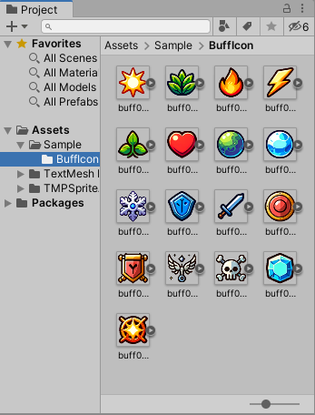
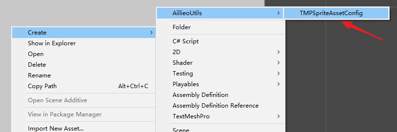
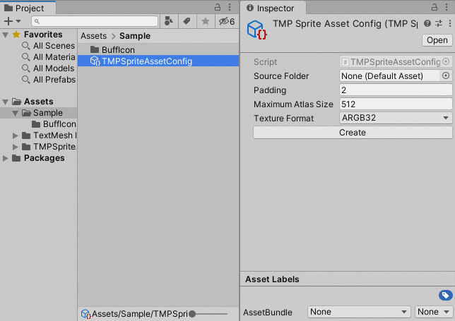
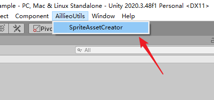
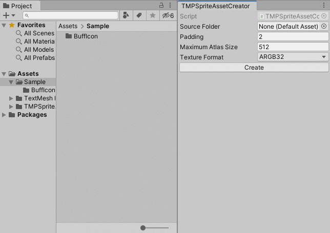
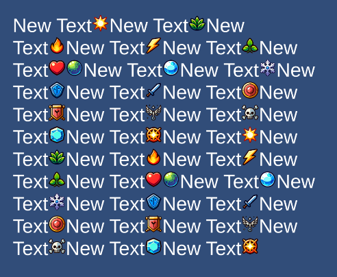

# Unity TMP Sprite Asset Creator

TMPSpriteAsset Creator是一个编辑器工具，用于简化Unity中TMPSpriteAsset的创建过程。它可以快速选择文件夹并一键生成TMPSpriteAsset，无需使用任何外部工具。

### 安装说明

#### 通过 Unity Package Manager安装

通过 Unity Package Manager安装的步骤

- 打开 Window/Package Manager

- 点击左上角的加号按钮，选择“Add package from git URL”

- 输入 URL：`https://github.com/aillieo/TMPSpriteAssetCreator.git#upm`

- 点击“Add”按钮

#### 手动安装

手动安装的步骤

- 克隆仓库到本地

- 打开 Unity 项目中的“Packages”文件夹

- 将克隆的仓库中“TMPSpriteAssetCreator”文件夹拖到“Packages”文件夹中

- Unity 将自动导入包

### 使用方法

1. 准备sprite图片，放入文件夹；

2. 创建TMPSpriteAsset时，有两种方法。第一种是创建一个配置文件（TMPSpriteAssetConfig）；

3. 在新建的配置文件中，指定存放sprite的文件夹，并按需修改参数，然后点击“创建”，即可生成。生成的文件默认会存放在与sprite文件夹同级的目录。使用配置文件的方法，便于后续更新和管理TMPSpriteAsset；

4. 另一种方法是直接从编辑器窗口（TMPSpriteAssetCreator）创建；

5. 在打开的窗口中，指定存放sprite的文件夹，并按需修改参数，然后点击“创建”，即可生成。生成的文件默认会存放在与sprite文件夹同级的目录。这种方法适合一次性地创建TMPSpriteAsset；

6. 在工程中使用创建的TMPSpriteAsset资产；

## 许可证

本项目采用 MIT 许可证。

---

# Unity TMP Sprite Asset Creator

TMPSpriteAsset Creator is an editor tool designed to simplify the creation of TMPSpriteAssets in Unity. It allows you to quickly select a folder and generate a TMPSpriteAsset with a single click, without the need for any external tools.

### Installation

#### Via the Unity Package Manager

Steps for installing via the Unity Package Manager

- Open the Unity Package Manager from the Window menu.

- Click the + button in the top left corner and select "Add package from git URL."

- Enter the following URL: `https://github.com/aillieo/TMPSpriteAssetCreator.git#upm`

- Click the "Add" button to add the package to your project.

#### Manual Installation

Steps for manual installation

- Clone the repository to your local machine.

- Open your Unity project and navigate to the "Packages" folder.

- Drag the "TMPSpriteAssetCreator" folder from the cloned repository into the "Packages" folder.

- Unity will automatically import the package.

### How to Use

1. Prepare your sprite images and place them in a folder;

2. There are two ways to create a TMPSpriteAsset. The first is to create a configuration file (TMPSpriteAssetConfig);

3. In the newly created configuration file, specify the folder containing the sprites and modify the parameters as needed, then click "Create". The generated file will by default be stored in a directory at the same level as the sprite folder. Using the configuration file method facilitates future updates and management of TMPSpriteAsset;

4. Another method is to create directly from the editor window (TMPSpriteAssetCreator);

5. In the opened window, specify the folder containing the sprites and modify the parameters as needed, then click "Create". The generated files will by default be stored in a directory at the same level as the sprite folder. This method is suitable for creating a TMPSpriteAsset on a one-time basis;

6. Use the created TMPSpriteAsset within your project;

## License

This project is licensed under the MIT License.
